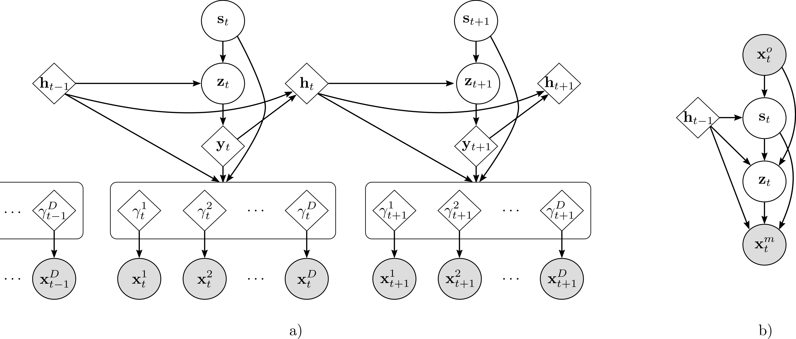
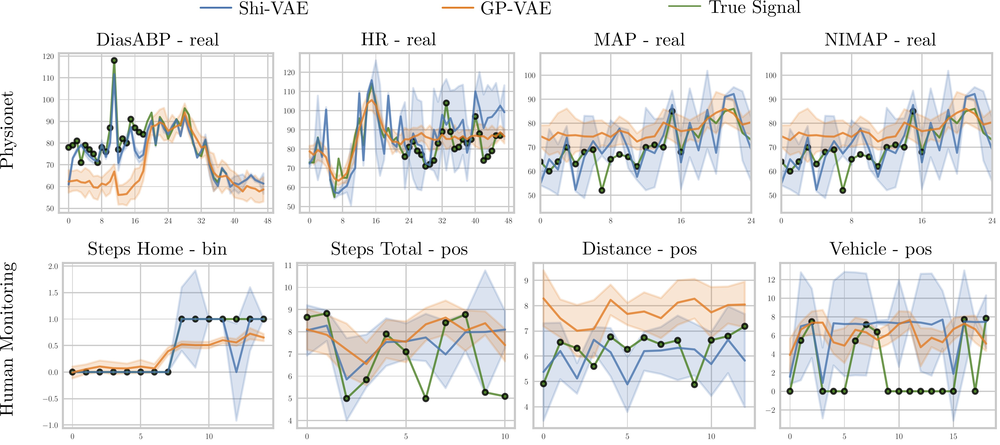

<div align="center">

# Shi-VAE




</div>

## Installation
The installation can be done using Conda:
```
conda env create -f environment.yml 
conda activate shivae
```
or using the requirements.txt. Using **pip**, it can be installed with the command below:

```
conda create -n shivae python=3.7 
conda activate shivae
pip install -r requirements.txt
```

## Data
### HMM Data
In `data/`, you can find an already created synthetic dataset using an Heterogeneous HMM.
If you want to create a custom heterogeneous HMM dataset, go to the [README.md](hmm_dataset/README.md) document inside 
[hmm_dataset](hmm_dataset). 

### Physionet
In `data/physionet_burst/` unzip the zip file:
```
tar -xvf physionet_burst.zip    
```

This zip file contains 4 files:

- `data_types.csv`: CSV file containing the information for all the attributes. 
- `data_types_real.csv`: CSV file containing the information for all the attributes, assuming **only real** values.
- `data_types_pos.csv`: CSV file containing the information for all the attributes, assuming **only positive** values.
- `physionet_burst.npz`: NPZ file containing:
    
    - `x_{set}_full`: Data for {set} containing all the observed attributes.
    - `x_{set}_miss`: Data for {set} containing observed values, **except those values used as artificial
      missing for evaluation**.
    - `m_{set}_miss`: Missing mask for {set}, containing real missing and artificial missing. 
    - `x_{set}_artificial`: Mask for {set} at **those observed values used for evaluation.**
    - `y_{set}`: y value for {set}.


## Usage
For running all the experiments, always use the `src` folder as working directory.
Some examples are included in [main_hmm.py](src/main_hmm.py) and [main_physionet.py](src/main_physionet.py). 
You can run the following command to run an example on the **synthetic dataset**:
```
python3 main_hmm.py --experiment hmm --train -1 --n_epochs 100 --z_dim 2 --K 3 --kl_annealing_epochs 20 --percent_miss 30
```
In case you want to check the performance with the **physionet dataset**, run this example:
```
python3 main_physionet.py --experiment physionet --train -1 --n_epochs 100 --z_dim 35 --K 10 --kl_annealing_epochs 20
```
By running these examples you will train the models and check the performance with some images generated for 
`reconstruction` and `generation`. 

For running the scripts used in the paper, you can just run
```
# Physionet Results, inside /src:
python3 results_hmm.py --train -1
# Physionet Results, inside /src:
python3 results_physionet.py --train -1
```

## Results



## Help
Using the `--help` option displays the following information.
```buildoutcfg
usage: main_hmm.py [-h] [--model MODEL] [--train TRAIN] [--restore RESTORE]
                   [--experiment EXPERIMENT] [--n_epochs N_EPOCHS]
                   [--kl_annealing_epochs KL_ANNEALING_EPOCHS]
                   [--l_rate L_RATE] [--percent_miss PERCENT_MISS]
                   [--save_model SAVE_MODEL] [--save_every SAVE_EVERY]
                   [--print_every PRINT_EVERY] [--plot_every PLOT_EVERY]
                   [--learn_std LEARN_STD] [--z_dim Z_DIM] [--h_dim H_DIM]
                   [--K K] [--local LOCAL] [--gpu GPU]
                   [--batch_size BATCH_SIZE] [--result_imgs RESULT_IMGS]
                   [--clip CLIP] [--data_dir DATA_DIR]
                   [--filter_vars FILTER_VARS [FILTER_VARS ...]]
                   [--dataset DATASET] [--ckpt_dir CKPT_DIR]
                   [--ckpt_file CKPT_FILE]

optional arguments:
  -h, --help            show this help message and exit
  --model MODEL         Used model.
  --train TRAIN         Training options [0: Results, 1:Train, -1:Train and
                        Result]
  --restore RESTORE     Restore training
  --experiment EXPERIMENT
                        Experiment name.
  --n_epochs N_EPOCHS   Number of epochs to train
  --kl_annealing_epochs KL_ANNEALING_EPOCHS
                        Number of epochs to apply annealing on KL divergence.
  --l_rate L_RATE       Learning rate
  --percent_miss PERCENT_MISS
                        Missing rate for HMM dataset, or any synthetic
                        dataset.
  --save_model SAVE_MODEL
                        Save model.
  --save_every SAVE_EVERY
                        Save model every n epochs
  --print_every PRINT_EVERY
                        Print model every n epochs
  --plot_every PLOT_EVERY
                        Plot ELBO every n epochs
  --learn_std LEARN_STD
                        Learn std for real and positive distributions.
  --z_dim Z_DIM         Dimension of z
  --h_dim H_DIM         Dimension of h
  --K K                 Dimension of latent code s for ShiVAE
  --local LOCAL         Set to 1 for local execution. 0 for cluster/server
                        execution.
  --gpu GPU             Select gpu=-1: CPU. Else: GPU.
  --batch_size BATCH_SIZE
                        Number of samples per batch-
  --result_imgs RESULT_IMGS
                        Number of images to show in reconstruction.
  --clip CLIP           Clipping value to avoid exploding gradients.
  --data_dir DATA_DIR   Parent directory for data.
  --filter_vars FILTER_VARS [FILTER_VARS ...]
                        Variables to use. Use None for using all variabes.
  --dataset DATASET     Name of the dataset for the experiment.
  --ckpt_dir CKPT_DIR   Parent directory to save models
  --ckpt_file CKPT_FILE
                        Pytorch Weights (.pth), with absolute path.


```

## Contributors
[Daniel Barrejon](http://www.tsc.uc3m.es/~dbarrejon/)  
[Pablo M. Olmos](http://www.tsc.uc3m.es/~olmos/)  
[Antonio Artés-Rodríguez](http://www.tsc.uc3m.es/~antonio/antonio_artes/Home.html)

## Contact Information
For any question regarding the code or the model, please send an email to: 
<a href="mailto:dbarrejo@ing.uc3m.es">dbarrejo@ing.uc3m.es</a>


